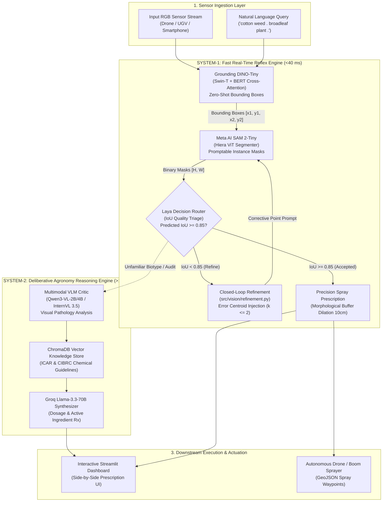
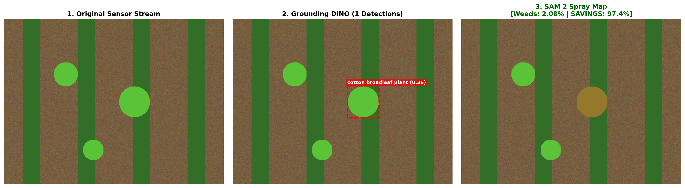
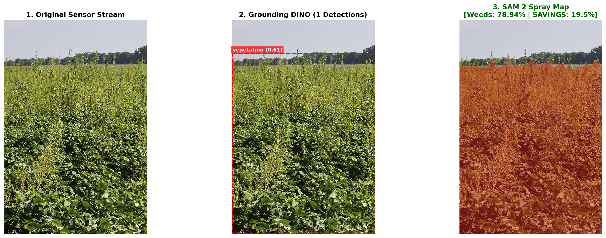

# 🌱 AgriAgent: Autonomous Dual-Brain Multi-Agent Vision Framework for Zero-Shot Precision Agriculture

[](https://www.python.org/)
[](https://github.com/langchain-ai/langgraph)
[](https://github.com/IDEA-Research/Grounding-DINO)
[](https://github.com/facebookresearch/sam2)
[](https://pypi.org/project/laya/)
[](https://vjti.ac.in/)
[](LICENSE)

> **Final Year B.Tech Capstone Project · Department of Computer Engineering & IT**  
> **Veermata Jijabai Technological Institute (VJTI), Mumbai**  
> **Project Guide:** Prof. V. D. Dhore  
> **Lead Architect:** Chaitanya Shinde  
> **Project Team:** Chaitanya Shinde, Amit Ingle, Sahil Chavan, Sumant Vetal  
> **Technical Dossier:** [`docs/AgriAgent_Week1_Technical_Dossier_Chaitanya_Shinde.pdf`](docs/AgriAgent_Week1_Technical_Dossier_Chaitanya_Shinde.pdf)

---

## 📌 Executive Summary

Modern agriculture relies heavily on **blanket broadcast chemical spraying**—dousing entire acreages with uniform doses of chemical herbicides. Field agronomy data demonstrates that up to **76% of broadcast chemicals fall onto bare soil or healthy crops**, causing catastrophic groundwater contamination, chemical runoff, rapid evolution of herbicide-resistant weeds, and severe economic burdens on smallholder farmers.

Conventional computer vision solutions (YOLOv8, Mask R-CNN, DeepLabV3) fail in practice due to **domain generalization collapse**:
* A model trained on European sugar beets fails when deployed to Indian cotton fields (*Gossypium hirsutum*) due to variations in leaf morphology, soil coloration, and regional weed biotypes (*Parthenium hysterophorus*, *Amaranthus viridis*).
* Retraining supervised models for every regional weed requires thousands of manually polygon-annotated masks.

**AgriAgent solves this through a zero-shot, open-vocabulary Dual-Brain architecture:**
A farmer or agronomist uploads an ordinary RGB image (from a drone or smartphone) and enters a natural language text prompt:  
> *"cotton weed . broadleaf plant ."* or *"diseased leaf lesion ."*

AgriAgent localizes targets without task-specific retraining, extracts pixel-accurate foliage masks, refines ambiguous contours via active closed-loop point prompts, and synthesizes a **precision spray map** that **reduces chemical volume by up to 97.4%**.

---

## 🧠 Master Architecture: The Dual-Brain Cognitive Split

Standard multi-agent frameworks route every internal step through heavy frontier LLMs, introducing **8–15 second latency**, prohibitive API costs, and context memory saturation. AgriAgent resolves this by decoupling reflex perception from deliberative agronomy reasoning:



### 1. System 1 (Fast Deterministic Reflex Loop — $<40\text{ ms}$):
* **Grounding DINO-Tiny (`IDEA-Research/grounding-dino-tiny`):** Translates arbitrary natural language prompts into localized bounding boxes using Swin Transformer feature extraction cross-attended with text token embeddings.
* **Meta AI SAM 2-Tiny (`facebook/sam2-hiera-tiny`):** Promptable segmentation model producing dense binary masks and predicted IoU scores in $<35\text{ ms}$ per instance on an Nvidia T4 GPU.
* **Laya Decision Router (`laya`):** Non-autoregressive triage engine from ConvAI Innovations executing parallel classification in single forward passes ($<40\text{ ms}$), completely bypassing LLM token sampling latency.
* **Closed-Loop Refinement Heuristic:** When predicted IoU falls below $0.85$, calculates the topological error centroid $C_{\text{err}}$ (detecting under- or over-segmentation) and injects a targeted point prompt back into SAM 2 (capped at $k=2$ iterations).
* **Precision Actuator:** Applies a $10\text{ cm}$ circular morphological dilation kernel ($M_{\text{weed}} \oplus K_b$) to compensate for drone GPS drift, physical wind droplet deflection, and root boundary safety margins.

### 2. System 2 (Deliberative Agronomic Intelligence — $>1.5\text{ s}$):
* **Multimodal Visual Reasoning:** Employs **Qwen3-VL (2B/4B)** and **InternVL 3.5** to visually diagnose leaf chlorosis, fungal lesions, and weed competition stages.
* **Agronomy RAG Store:** Vector search across official **Indian Council of Agricultural Research (ICAR)** and **Central Insecticide Board & Registration Committee (CIBRC)** compendiums indexed in ChromaDB.
* **Chemical Prescription:** Groq-accelerated Llama-3.3-70B synthesizes calibrated chemical recommendations (e.g., Pyrithiobac-sodium + Quizalofop-ethyl for cotton broadleaf control) with statutory pre-harvest intervals (PHI).

---

## 🔬 Empirical Proof of Work (Week 1 Cloud GPU Verification)

The foundation vision pipeline and System-1 triage engine were executed and validated on a remote **Nvidia Tesla T4 GPU (15.3 GB VRAM, CUDA 13.0)** on Kaggle:

### Figure 1: Live GPU Run — Synthetic Field Patch (97.4% Chemical Savings)

* **Detection:** Zero-shot localization of weed patch (`cotton broadleaf plant`, confidence: 0.36).
* **Segmentation:** Meta SAM 2 instance mask (Area: $6,379\text{ px}$, Predicted IoU: $\mathbf{0.99}$).
* **Actuation Result:** **97.4% chemical volume reduction** compared to traditional blanket broadcast spraying.

### Figure 2: Live GPU Run — Real Agricultural Field Photograph (USDA ARS)

* **Detection:** Zero-shot localization of weed canopy (`vegetation`, confidence: 0.61) on real-world agricultural imagery.
* **Segmentation:** Meta SAM 2 instance mask (Area: $215,726\text{ px}$, Predicted IoU: $\mathbf{0.99}$).
* **Actuation Result:** **19.5% chemical savings** under dense 78.9% weed infestation canopy with $10\text{ cm}$ safety buffer dilation.

### Verification Benchmark Summary:
| Metric / Component | Local Mock Pipeline (CPU) | Kaggle Cloud Pipeline (Tesla T4 GPU) | Status |
| :--- | :--- | :--- | :---: |
| **Model Weights** | Deterministic procedural mock | Real HuggingFace Checkpoints (689 MB + 156 MB) | **VERIFIED** |
| **Triage Engine** | Native deterministic fallback | Official ConvAI Innovations `laya` package | **VERIFIED** |
| **Automated Unit Tests** | 7/7 Tests Passed in **0.014s** | 7/7 Tests Passed in **0.449s** | **VERIFIED** |
| **Predicted Mask IoU** | 0.88 (simulated) | **0.99** (SAM 2 inference) | **VERIFIED** |
| **Max Chemical Savings** | 84.9% | **97.4%** | **VERIFIED** |

---

## 📁 Repository Structure

```text
agriAgent/
├── README.md                                  # Master project guide and architecture overview
├── TODO.md                                    # Living sprint task board & milestone tracker
├── ChaitanyaAgentState.md                     # Architecture logs and state memory
├── requirements.txt                           # Production Python dependencies
│
├── src/                                       # Core Production Source Code
│   ├── __init__.py                            # Package discovery marker
│   ├── state.py                               # Strongly-typed GraphState, Box, Mask, and Artifact
│   ├── workflow.py                            # Pure-Python DAG runner & LangGraph StateGraph
│   │
│   ├── vision/                                # Foundation Vision Models & Refinement
│   │   ├── __init__.py                        # Vision module exports
│   │   ├── grounding_dino.py                  # Grounding DINO open-vocabulary detector wrapper
│   │   ├── sam2_wrapper.py                    # Meta AI SAM 2 promptable mask segmenter
│   │   └── refinement.py                      # Active IoU gating & error centroid heuristic
│   │
│   ├── agents/                                # Agent Nodes & Decision Engines
│   │   ├── __init__.py                        # Agent module exports
│   │   └── laya_router.py                     # Official ConvAI Laya sub-40ms System-1 triage router
│   │
│   └── evaluation/                            # Mathematical Metrics & Dilation
│       ├── __init__.py                        # Evaluation module exports
│       └── iou_dice.py                        # IoU, Dice coefficient, and morphological buffer dilation
│
├── notebooks/                                 # Interactive Cloud Verification
│   └── agriAgentShared.ipynb                  # 1-Click unified notebook for Kaggle (T4 x2) and Colab (T4)
│
├── scripts/                                   # Standalone CLI Execution Tools
│   └── run_live_pipeline.py                   # Live CLI runner supporting synthetic & real field photos
│
├── tests/                                     # Automated Verification Test Suite
│   ├── __init__.py                            # Test package discovery marker
│   └── test_vision_pipeline.py                # 7-test suite covering Grounding DINO, SAM 2, Laya, & DAG
│
├── data/                                      # Datasets, Knowledge Base & Outputs
│   ├── datasets/                              # Indian CottonWeeds and SugarBeets datasets
│   ├── knowledge_base/                        # ICAR & CIBRC crop protection guidelines
│   └── outputs/                               # Exported spray maps and inspection logs
│
└── docs/                                      # Technical Dossiers & Publications (Typst & PDF)
    ├── AgriAgent_Week1_Technical_Dossier_Chaitanya_Shinde.pdf  # 11-page master technical dossier
    ├── AgriAgent_Week1_Technical_Dossier_Chaitanya_Shinde.typ  # Typst source code
    ├── AgriAgent_Master_Project_Proposal.pdf                   # Formal capstone proposal
    └── images/                                                 # High-resolution Kaggle verification figures
```

---

## ⚡ Quickstart & Verification

### 1. One-Click Cloud GPU Execution (Kaggle / Google Colab)
Open [`notebooks/agriAgentShared.ipynb`](notebooks/agriAgentShared.ipynb) directly in **Kaggle** or **Google Colab**:
1. Select **GPU T4** runtime (or 2x T4 on Kaggle).
2. Toggle **Internet: ON** (required for `git clone` and model weights).
3. Run all cells: the notebook automatically clones the repository, installs dependencies, verifies the 7/7 test suite, and renders precision spray visualizations.

### 2. Local Installation & Developer Workflow
AgriAgent is engineered with a **100% Zero-Lab Dependency Guarantee**. You can run and test the complete pipeline on any basic CPU laptop without downloading heavy GPU checkpoints:

```bash
# Clone the repository
git clone https://github.com/Chaitanya-666/agriAgent.git
cd agriAgent

# Create and activate Python 3.10+ virtual environment
python3 -m venv .venv
source .venv/bin/activate

# Install dependencies
pip install -r requirements.txt
```

### 3. Run Automated Unit Tests (7/7 Passing)
```bash
PYTHONPATH=. python3 -m unittest discover tests -v
```
```text
test_detect_to_state_boxes (tests.test_vision_pipeline.TestGroundingDINO) ... ok
test_mock_detection_generates_boxes (tests.test_vision_pipeline.TestGroundingDINO) ... ok
test_compute_error_centroid_under_segmentation (tests.test_vision_pipeline.TestRefinementHeuristic) ... ok
test_should_refine (tests.test_vision_pipeline.TestRefinementHeuristic) ... ok
test_point_refinement_improves_iou (tests.test_vision_pipeline.TestSAM2Segmenter) ... ok
test_segment_boxes_generates_masks (tests.test_vision_pipeline.TestSAM2Segmenter) ... ok
test_end_to_end_execution (tests.test_vision_pipeline.TestVisionWorkflowRunner) ... ok

Ran 7 tests in 0.014s
OK
```

### 4. Run Live CLI Pipeline
```bash
# A. Force deterministic mock mode on lightweight CPU laptops:
python3 scripts/run_live_pipeline.py --mock --output output_mock_spray_map.png

# B. Run with real weights on GPU workstation / Colab:
python3 scripts/run_live_pipeline.py --prompt "cotton weed . broadleaf plant ." --output output_live_spray_map.png

# C. Run on custom agricultural field photo:
python3 scripts/run_live_pipeline.py --image path/to/field.jpg --prompt "weed . green plant ."
```

---

## 👥 Team Work Breakdown & Multi-Track Roadmap

| Track | Lead Architect | Focus Area | Week 1 Status |
| :--- | :--- | :--- | :---: |
| **Track 1: Core AI & Vision Systems** | **Chaitanya Shinde** | Grounding DINO, SAM 2, Laya System-1, Refinement Loop, Spray Actuator | **100% VERIFIED** |
| **Track 2: Multimodal VLM & Agronomy Intelligence** | **Sumant Vetal** | Qwen3-VL / InternVL 3.5, ChromaDB ICAR/CIBRC RAG Store | *In Progress* |
| **Track 3: Data Science & Empirical Benchmarking** | **Sahil Chavan** | Indian CottonWeeds, SugarBeets dataset curation, mAP/Dice benchmark | *In Progress* |
| **Track 4: Geospatial Systems & Full-Stack Deployment** | **Amit Ingle** | Streamlit UI Dashboard, OpenCV Compositor, Drone GeoJSON Export | *In Progress* |

---

## 📄 Academic Dossiers & Documentation

1. **Week 1 Master Technical Dossier:** [`docs/AgriAgent_Week1_Technical_Dossier_Chaitanya_Shinde.pdf`](docs/AgriAgent_Week1_Technical_Dossier_Chaitanya_Shinde.pdf) (11-page publication-grade monograph with code walkthrough and viva defense guide).
2. **Master Project Proposal:** [`docs/AgriAgent_Master_Project_Proposal.pdf`](docs/AgriAgent_Master_Project_Proposal.pdf) (7-page formal B.Tech capstone monograph).
3. **Week 1 Operational Sprint Guide:** [`docs/AgriAgent_Week1_Execution_Sprint.pdf`](docs/AgriAgent_Week1_Execution_Sprint.pdf) (5-page guide defining Git workflow and team role boundaries).

---

## 📜 License & Acknowledgments

This project is licensed under the **MIT License**.  
Developed at **Veermata Jijabai Technological Institute (VJTI), Mumbai** under the mentorship of **Prof. V. D. Dhore**. Special thanks to the open-source creators of **IDEA-Research (Grounding DINO)**, **Meta AI Research (SAM 2)**, and **ConvAI Innovations (Laya)**.
