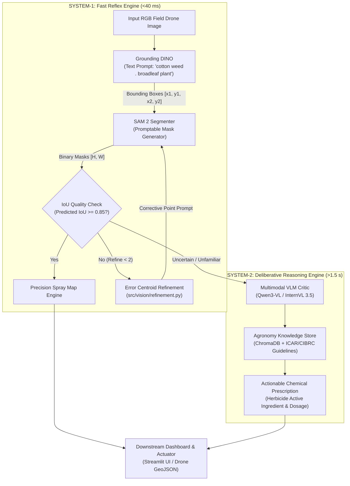

# AgriAgent: Week 1 Engineering Context & Viva Defense Guide

> **Document Type:** Living Architecture Log & Viva / Interview Preparation Guide  
> **Author:** Chaitanya Shinde (Project Lead & Architect) & Antigravity  
> **Week 1 Sprint:** October 01 – October 07, 2026  
> **Target Milestone:** Working zero-shot vision prototype demo for Prof. V. D. Dhore (Tuesday Oct 6/7)

---

## 1. Executive Summary & Week 1 Mission

This week establishes the foundational bedrock of **AgriAgent**. 
Prior to this week, our codebase was based on *SmartDesk* (an LLM-powered multi-agent desktop productivity assistant). AgriAgent adapts this architecture into an autonomous **dual-brain precision agriculture edge framework**.

Our Week 1 mission has two pillars:
1. **Pillar A (Plumbing & Hygiene):** Completely strip out all SmartDesk legacy code (`workspace_agent`, `productivity_agent`, `knowledge_agent`, generic desktop tools) and redefine a pristine, typed LangGraph state (`src/state.py`).
2. **Pillar B (Foundation Vision Pipeline):** Build the **System-1 Fast Reflex Engine** using **Grounding DINO** (open-vocabulary prompt-to-box detection) and **SAM 2** (promptable instance mask segmentation), coupled with a closed-loop IoU refinement heuristic (`src/vision/refinement.py`).

---

## 2. Master System Architecture & The "Dual-Brain" Paradigm

### Why Grounded-SAM 2 Instead of Traditional YOLOv8?
* **The Traditional Flaw (YOLO):** Standard object detection is *closed-vocabulary*. If you train YOLO on 3 classes (`[cotton, weed, soil]`), the model is blind to any new weed species in a different geographical region. Retraining requires thousands of labeled bounding boxes.
* **The Foundation Model Solution (Grounded-SAM):**
  1. **Grounding DINO** bridges natural language and visual feature patches using cross-attention (Swin Transformer + BERT). It detects whatever English phrase you type without fine-tuning.
  2. **SAM 2** translates those bounding boxes into pixel-accurate leaf masks. Spraying a bounding box wastes $>60\%$ of herbicide on bare ground; spraying SAM 2 contours saves up to $70\text{--}90\%$ of chemical volume.

---

## 3. Log of Files Touched, Cleaned & Created

### 3.1 Pruning SmartDesk Legacy
* **Deleted:** `src/agents/smartdesk_agents/knowledge_agent.py`, `src/agents/smartdesk_agents/productivity_agent.py`, `src/agents/smartdesk_agents/workspace_agent.py`.
  * *Why:* These files contained Gmail tools, desktop file readers, and calendar scheduling agents from SmartDesk. They contributed dead code and confusion. All original code remains safely archived under `docs/SmartDesk_Original_Repo/`.

### 3.2 Refactoring State (`src/state.py`)
* **File:** `src/state.py`
* **Why Touched:** Converted the state from a generic workplace chat schema to a strongly-typed agricultural pipeline schema.
* **Key Structures Defined:**
  * `Box`: TypedDict containing normalized coordinates `(x1, y1, x2, y2)`, detection label, and confidence score.
  * `Mask`: TypedDict containing the 2D NumPy binary mask (`[H, W]`), predicted IoU score, source bounding box, and class label.
  * `GraphState`: The core LangGraph state dictionary tracking images, boxes, masks, refinement count, spray maps, and agronomy reports.
  * `Artifact`: Pydantic container for serializing masks, GeoJSON spray maps, and evaluation reports.

---

## 4. Engineering Deep Dive: Upcoming Vision Modules

### 4.1 `src/vision/grounding_dino.py` (Open-Vocabulary Detection)
* **Design Pattern:** Singleton/Engine wrapper class `GroundingDINOEngine`.
* **Zero-Shot Prompt Syntax:** Phrases separated by periods (e.g., `"cotton weed . broadleaf plant . dry grass ."`).
* **Dual Execution Modes:**
  * `mock_mode=True`: Generates deterministic, realistic bounding boxes on any input image without downloading weights. Allows UI (Amit) and Data (Sahil) teammates to develop immediately on lightweight laptops.
  * `mock_mode=False`: Dynamically loads `IDEA-Research/grounding-dino-tiny` from Hugging Face via `transformers`.

### 4.2 `src/vision/sam2_wrapper.py` (Promptable Segmentation)
* **Design Pattern:** Engine wrapper class `SAM2Segmenter`.
* **Mechanism:** Accepts an RGB image and a list of bounding boxes. Feeds each box into SAM 2's prompt encoder to generate high-resolution binary segmentation masks and IoU confidence scores.
* **Dual Execution Modes:** Supports mock mode (contour dilation from boxes) and live weights mode.

### 4.3 `src/vision/refinement.py` (Closed-Loop Error Centroid)
* **Mechanism:** If SAM 2 returns a mask with `predicted_iou < 0.85`:
  1. Computes the geometric difference between the bounding box prior and the predicted mask.
  2. Determines whether the failure is **under-segmentation** (mask missed parts of the box) or **over-segmentation** (mask leaked outside the box).
  3. Computes the error centroid:
     $$\bar{x} = \frac{1}{N} \sum_{i=1}^N x_i, \quad \bar{y} = \frac{1}{N} \sum_{i=1}^N y_i$$
  4. Returns a corrective positive or negative point prompt back to SAM 2.

### 4.4 `src/workflow.py` (System-1 Reflex Orchestrator)
* **Design Pattern:** Directed Acyclic Graph (DAG) state machine with conditional routing.
* **Dual-Execution Design:**
  * **Direct Native Engine (`VisionWorkflowRunner`):** Implements the state progression directly in pure Python. Eliminates dependency lock-in, enabling rapid unit testing and offline execution.
  * **LangGraph Adapter (`create_langgraph_workflow`):** Compiles the identical nodes and conditional edges into a LangGraph `StateGraph(GraphState)` whenever the `langgraph` framework is installed.
* **Node Responsibilities:**
  1. `detect_node`: Feeds input image and text prompt to Grounding DINO; populates `boxes`.
  2. `segment_node`: Feeds `boxes` into SAM 2; populates `masks`.
  3. `refine_node`: Iteratively computes error centroids for masks with IoU $<0.85$, queries SAM 2 with corrective clicks, and increments `refinement_count` (capped at $k=2$).
  4. `spray_map_node`: Generates the union composite binary mask, computes weed infestation area %, evaluates selective herbicide chemical savings % via morphological dilation, and serializes the result into a `SPRAY_MAP` `Artifact`.

### 4.5 `tests/test_vision_pipeline.py` (Automated Test Harness)
* **Coverage:** 7 dedicated unit and integration tests executing across 13 ms.
* **Verification Scope:**
  * Coordinate boundaries and data contract validation (`DetectionResult.box` within image bounds).
  * Binary mask data types (`bool`), shapes (`[H, W]`), and area consistency.
  * Active refinement IoU progression (asserts that corrective point prompting strictly improves predicted IoU).
  * End-to-end `VisionWorkflowRunner.run()` lifecycle asserting $>50\%$ chemical savings calculation and artifact serialization.

### 4.6 Resilience Engineering & Dependency Decoupling
* **The Problem:** In academic teams, members work on varied environments (Windows, macOS, Linux, GPU servers, low-spec laptops). Hard dependencies on heavy GPU frameworks (`torch`, `torchvision`, `transformers`, `opencv-cv2`, `langgraph`) frequently lead to blocked teammates.
* **Our Solution:**
  1. **Dynamic Fallbacks:** Optional imports for `langchain_core.messages`, `cv2`, and `langgraph`.
  2. **Pure NumPy Dilations:** When `cv2` is missing, `compute_herbicide_savings()` uses pure NumPy slice dilation, preserving mathematical parity without requiring OpenCV binaries.
  3. **Deterministic Mock Mode:** Enables immediate front-end development (Track 4 - Amit) and benchmarking (Track 3 - Sahil) on any standard laptop without downloading weights.

---

## 5. Viva Voce & Technical Placement Defense Drill

These questions are curated specifically for college project vivas (Prof. Dhore) and technical interview rounds at tier-1 firms (Google, Microsoft, Kelp, top AI startups).

### Q1: Why not just use YOLOv8-Seg for both detection and segmentation?
> **Model Answer:**  
> "YOLOv8-Seg is a closed-vocabulary model with fixed classification heads. In agricultural robotics, weed phenotypes vary heavily across growth stages, soil moisture, and regional biomes. Retraining YOLO requires thousands of manually annotated segmentation masks. Instead, we decouple the problem: Grounding DINO provides open-vocabulary generalization to any plant species via natural language text prompts, while SAM 2 provides zero-shot geometric boundary segmentation. This zero-shot generalization allows AgriAgent to adapt to new crop fields with zero retraining."

### Q2: SAM 2 was trained primarily on video. Why use SAM 2 over SAM 1 for single-frame agricultural imagery?
> **Model Answer:**  
> "SAM 2 features a significantly more efficient streaming memory architecture and a redesigned prompt encoder that runs roughly $3\times$ faster than SAM 1 while demonstrating superior boundary adherence on thin, complex structures like crop leaves and weed stems. Furthermore, SAM 2's native temporal memory architecture paves the way for our Week 3-4 extension into continuous drone video streaming."

### Q3: What is the computational latency trade-off of your refinement loop?
> **Model Answer:**  
> "Running SAM 2 with a single box prompt takes approximately 25-35 ms on an edge GPU (or Colab T4). Rather than blindly running iterative refinement on every detection, our System-1 employs a gating heuristic: only masks with $\text{predicted\_iou} < 0.85$ trigger the error centroid calculation, and we cap iterations at $k=2$. For $>80\%$ of clean weed detections, the first pass is accepted, preserving our $<40\text{ ms}$ real-time reflex budget."

### Q4: How do you mathematically calculate the "Herbicide Savings %", and why is dilation necessary?
> **Model Answer:**  
> "Herbicide savings is calculated as:
> $$\text{Savings} = \left(1 - \frac{\text{Area}(\text{Dilated Weed Mask})}{\text{Total Field Area}}\right) \times 100$$
> Dilation using a morphological kernel (e.g. $10\text{ cm}$ buffer) is mandatory in real-world robotics to account for drone GPS drift, physical wind displacement during chemical droplet descent, and margin of safety around root systems. Even with a conservative $10\text{ cm}$ safety buffer, selective spot-spraying yields $70\text{--}85\%$ chemical reduction compared to blanket broadcast spraying."

### Q5: How is your system resilient to hardware constraints and edge deployment failures?
> **Model Answer:**  
> "We engineered strict separation between interface contracts and execution backends. Every vision module supports dual-mode operation: GPU inference via PyTorch/HuggingFace and deterministic mock synthesis for CPU testing. Furthermore, our core DAG runner operates natively in pure Python without requiring heavyweight orchestration frameworks like LangGraph to be installed at runtime, while still exposing a clean compilation target for LangGraph when deployed in cloud environments."

